# DevOps Final Project

Unified DevOps capstone combining **CI/CD**, **Infrastructure as Code**, **Blue-Green Deployment**, **Observability** (Prometheus, Grafana, Loki), **Security Automation**, and **Reliability** improvements from Assignments 1, Midterm, and Observability Lab.

**Repository:** [https://github.com/NikaGeladze/DevOpsFinalProject](https://github.com/NikaGeladze/DevOpsFinalProject)

**Prior work integrated:**

- [ci-cd-app](https://github.com/NikaGeladze/ci-cd-app) — GitHub Actions CI/CD + Render deployment
- [DevOpsMidterm](https://github.com/NikaGeladze/DevOpsMidterm) — Web app, IaC, blue-green, health checks
- [observability-lab](https://github.com/NikaGeladze/observability-lab) — Prometheus, Grafana, Loki, alerting

---

## Quick Start (Single Command)

```bash
git clone https://github.com/NikaGeladze/DevOpsFinalProject.git
cd DevOpsFinalProject
./setup.sh
```

This script:

1. Creates `.env` from `.env.example`
2. Installs Node.js dependencies (if Node is available)
3. Starts the full Docker Compose stack (app + observability)
4. Runs automated environment validation

| Service      | URL                   | Credentials      |
| ------------ | --------------------- | ---------------- |
| Demo App     | http://localhost:5000 | —                |
| Prometheus   | http://localhost:9090 | —                |
| Grafana      | http://localhost:3000 | admin / admin123 |
| Alertmanager | http://localhost:9093 | —                |
| Loki         | http://localhost:3100 | —                |

---

## Project Architecture

```
┌─────────────────────────────────────────────────────────────────────────┐
│                         Developer Workflow                              │
│  git push/PR → GitHub Actions (lint, test, security) → Render (main)   │
└─────────────────────────────────────────────────────────────────────────┘

┌─────────────────────────────────────────────────────────────────────────┐
│                    demo-app :5000 (Node.js + Express)                   │
│  Routes: /, /greet, /user/:id, /health, /metrics, /error, /stress      │
│  JSON logs → stdout  │  Prometheus metrics → /metrics                   │
└───────┬─────────────────────────────┬───────────────────────────────────┘
        │ scrape /metrics             │ Docker logs
        ▼                             ▼
┌──────────────┐               ┌──────────────┐
│  Prometheus  │               │   Promtail   │
│    :9090     │               │    :9080     │
└──────┬───────┘               └──────┬───────┘
       │ rules                         │ push
       ▼                               ▼
┌──────────────┐               ┌──────────────┐
│ Alertmanager │               │     Loki     │
│    :9093     │               │    :3100     │
└──────────────┘               └──────┬───────┘
                                      │
                                      ▼
                               ┌──────────────┐
                               │   Grafana    │
                               │    :3000     │
                               └──────────────┘
```

---

## Tech Stack

| Tool                    | Purpose                                       |
| ----------------------- | --------------------------------------------- |
| Node.js + Express       | Web application                               |
| Jest + Supertest        | Unit tests                                    |
| ESLint                  | Code linting                                  |
| Docker + Docker Compose | Containerization & local stack                |
| GitHub Actions          | CI/CD pipeline                                |
| Render                  | Cloud deployment (free tier)                  |
| Prometheus              | Metrics collection                            |
| Grafana                 | Dashboards & visualization                    |
| Loki + Promtail         | Log aggregation                               |
| Alertmanager            | Alert routing                                 |
| Trivy                   | Container & filesystem vulnerability scanning |
| Gitleaks                | Secrets scanning                              |
| Hadolint                | Dockerfile linting                            |
| Bash scripts            | IaC, deploy, rollback, health checks          |

---

## Project Structure

```
DevOpsFinalProject/
├── app/                        # Node.js application
│   ├── src/                    # app.js, server.js, logger.js
│   ├── tests/                  # Jest unit tests
│   ├── public/                 # Frontend form
│   └── Dockerfile
├── prometheus/                 # Metrics & alert rules
├── grafana/                    # Dashboards & datasources
├── loki/                       # Log storage config
├── promtail/                   # Log shipper config
├── alertmanager/               # Alert routing
├── scripts/
│   ├── setup.sh                # IaC — single-command setup
│   ├── deploy.sh               # Blue-green (local)
│   ├── rollback.sh             # Rollback green → blue
│   ├── deploy-docker.sh        # Docker redeploy
│   ├── health_check.sh         # Periodic health monitoring
│   ├── trigger-alert.sh        # Simulate CRITICAL alert
│   ├── validate-env.sh         # Environment validation
│   └── post-deploy-check.sh    # Post-deployment smoke tests
├── docs/
│   ├── slo.md                  # Service level objectives
│   ├── incident-response.md    # Incident runbook
│   └── rollback-procedure.md     # Rollback guide
├── .github/workflows/ci-cd.yml # CI/CD + security pipeline
├── docker-compose.yml
├── setup.sh                    # Root wrapper → scripts/setup.sh
└── screenshots/                # Evidence images
```

---

## Environment Setup

### Prerequisites

- Docker & Docker Compose
- Git
- Node.js 18+ (optional, for local dev without Docker)

### Option A — Full Stack (Recommended)

```bash
./setup.sh
./scripts/validate-env.sh
```

### Option B — Local Development (No Docker)

```bash
cd app && npm install
npm test
npm run lint
PORT=5000 npm start
```

### Option C — Blue-Green Deployment (Local)

```bash
cd app && npm install
./scripts/deploy.sh blue    # Production on port 3000
./scripts/deploy.sh green   # Staging on port 3001
./scripts/rollback.sh       # Stop green, keep blue
```

---

## CI/CD Pipeline

```
Push / Pull Request
        │
        ▼
┌───────────────────────┐
│  Lint & Test          │  Node 18.x + 20.x matrix
│  • npm ci             │  ESLint + Jest
│  • npm run lint       │
│  • npm test           │
└───────────┬───────────┘
            │ pass
            ▼
┌───────────────────────┐
│  Security Scanning    │
│  • npm audit          │
│  • Gitleaks           │
│  • Hadolint           │
│  • Trivy (fs + image) │
│  • docker compose cfg │
└───────────┬───────────┘
            │ pass + push to main
            ▼
┌───────────────────────┐
│  Deploy to Render     │  RENDER_DEPLOY_HOOK_URL secret
└───────────┬───────────┘
            ▼
┌───────────────────────┐
│  Post-Deploy Verify   │  Smoke tests on PRODUCTION_URL
└───────────────────────┘
```

### GitHub Secrets Required (Cloud Deploy)

| Secret                   | Description                                         |
| ------------------------ | --------------------------------------------------- |
| `RENDER_DEPLOY_HOOK_URL` | Render deploy hook URL                              |
| `PRODUCTION_URL`         | Live app URL (e.g. `https://your-app.onrender.com`) |

### Branches

- `main` — production; triggers deploy after CI + security pass
- `dev` — development; CI only, no deploy

---

## Deployment Workflow

### Local Docker Deploy

```bash
./scripts/deploy-docker.sh v1.1.0
```

### Blue-Green (Local)

1. Deploy blue (production): `./scripts/deploy.sh blue`
2. Deploy green (candidate): `./scripts/deploy.sh green`
3. Test green on http://localhost:3001
4. Rollback if needed: `./scripts/rollback.sh`

See [docs/rollback-procedure.md](docs/rollback-procedure.md) for full rollback guide including Render.

---

## Security Implementation

| Check                      | Tool                                    | Where               |
| -------------------------- | --------------------------------------- | ------------------- |
| Dependency vulnerabilities | `npm audit`                             | CI pipeline         |
| Secrets in repo            | Gitleaks                                | CI pipeline         |
| Dockerfile best practices  | Hadolint                                | CI pipeline         |
| Container image CVEs       | Trivy                                   | CI pipeline         |
| Filesystem CVEs            | Trivy FS                                | CI pipeline         |
| Compose validation         | `docker compose config`                 | CI pipeline         |
| Secrets management         | GitHub Actions secrets + `.env.example` | Never commit `.env` |

Configuration: [.gitleaks.toml](.gitleaks.toml), [app/Dockerfile](app/Dockerfile)

---

## Monitoring, Logging & Alerting

### Metrics (Prometheus)

Custom counters exposed at `/metrics`:

- `app_requests_total{method, endpoint, status}`
- `app_errors_total{endpoint}`
- `app_request_duration_seconds{endpoint}`

### Logging (Loki + Promtail)

JSON-structured logs to stdout:

```json
{
  "timestamp": "2026-07-01T12:00:00",
  "level": "INFO",
  "service": "demo-app",
  "message": "Handling request on /",
  "logger": "demo-app"
}
```

Promtail ships Docker container logs to Loki. Filter in Grafana Explore: `{service="demo-app"} |= "ERROR"`.

### Alerting Rules

| Alert              | Severity | Condition                 |
| ------------------ | -------- | ------------------------- |
| HighErrorRate      | CRITICAL | > 5 errors/min            |
| ElevatedErrorRate  | WARNING  | > 2 errors/min            |
| DemoAppDown        | CRITICAL | `up{job="demo-app"} == 0` |
| HighRequestLatency | WARNING  | p95 > 1s                  |

### Trigger CRITICAL Alert

```bash
./scripts/trigger-alert.sh
# Then check: http://localhost:9090/alerts
```

### Health Monitoring

```bash
./scripts/health_check.sh   # logs to logs/health.log every 30s
```

---

## Reliability Improvements

| Improvement               | Implementation                                                           |
| ------------------------- | ------------------------------------------------------------------------ |
| Service health monitoring | Docker healthchecks + `health_check.sh`                                  |
| Rollback procedure        | `rollback.sh` + [docs/rollback-procedure.md](docs/rollback-procedure.md) |
| Incident response         | [docs/incident-response.md](docs/incident-response.md)                   |
| SLO definitions           | [docs/slo.md](docs/slo.md)                                               |
| Improved alerting         | 4 Prometheus rules + Alertmanager routing                                |
| Post-deploy verification  | `post-deploy-check.sh` in CI                                             |
| Environment validation    | `validate-env.sh` after setup                                            |

---

## Screenshots & Evidence

Replace or add your own screenshots in `screenshots/` and reference them below.

### 1. CI/CD Pipeline (GitHub Actions)

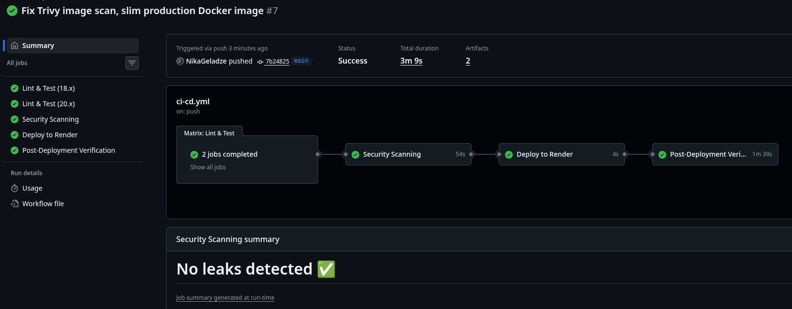

> **How to capture:** Push to `main` or open a PR → GitHub → Actions → open latest workflow run → screenshot all jobs (lint, security, deploy).

### 2. Security Scanning Results

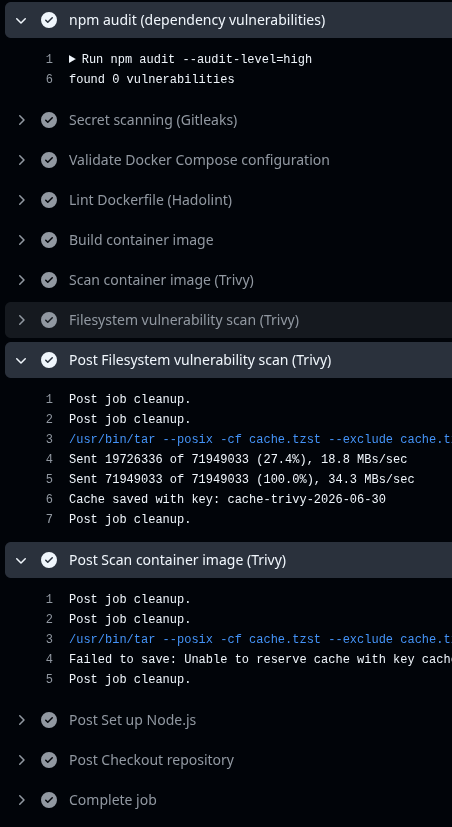

> **How to capture:** Actions → open the "Security Scanning" job → screenshot Trivy, Gitleaks, npm audit steps.

### 3. Grafana Dashboard (Custom Metrics)

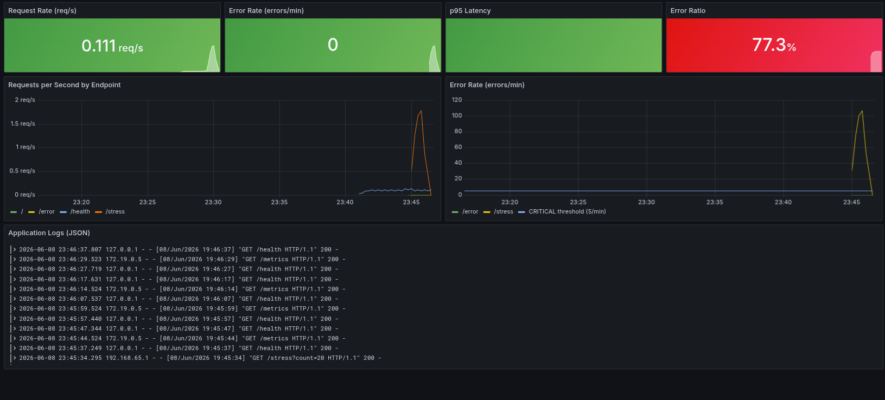

> **How to capture:** http://localhost:3000 → Dashboards → Demo App → screenshot panels showing `app_requests_total` and error rate.

### 4. JSON Logs in Grafana (Loki)

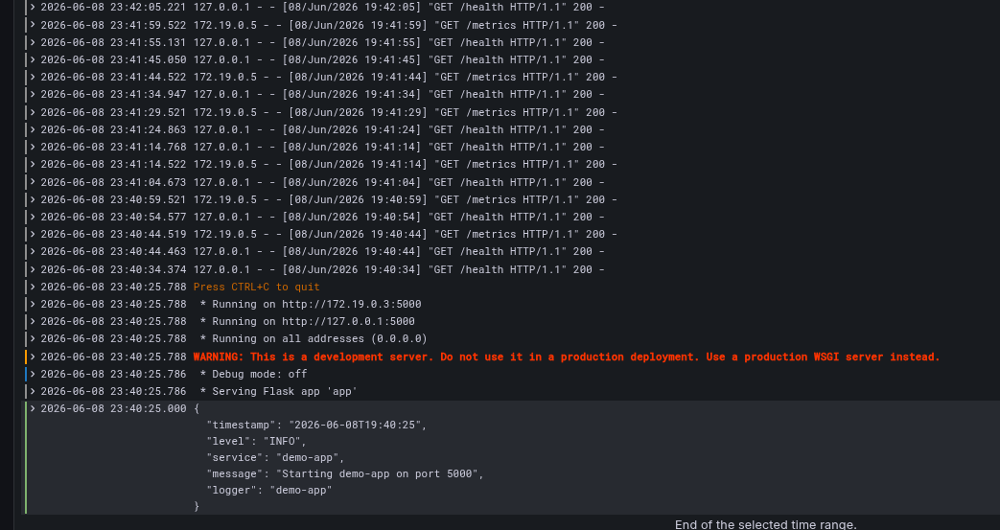

> **How to capture:** Grafana → Explore → Loki → query `{service="demo-app"}` → screenshot filtered JSON logs.

### 5. Active Alert Rule

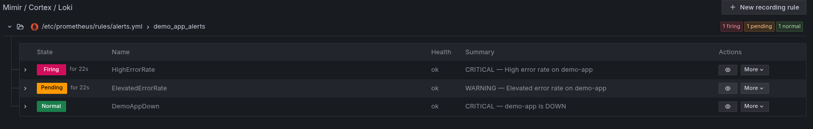

> **How to capture:** Run `./scripts/trigger-alert.sh` → screenshot http://localhost:9090/alerts showing `HighErrorRate` FIRING.

### 6. Running Application

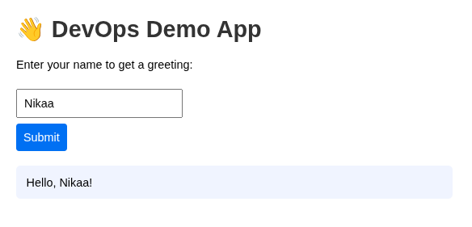

> **How to capture:** http://localhost:5000/index.html → screenshot the web UI with greeting form.

### 7. Blue-Green Deployment

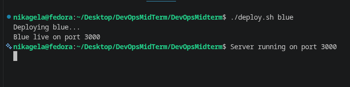
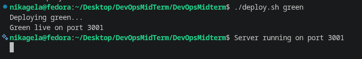

> **How to capture:** Run `./scripts/deploy.sh blue` and `./scripts/deploy.sh green` → screenshot both ports in browser.

### 8. Rollback

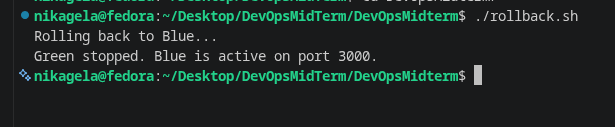

> **How to capture:** Run `./scripts/rollback.sh` → screenshot terminal output.

### 9. Health Check Logs

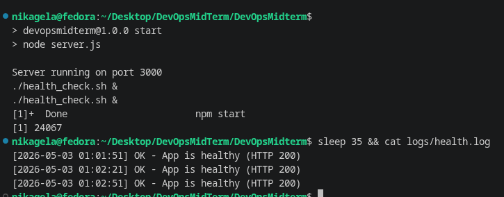

> **How to capture:** Run `./scripts/health_check.sh` for 1–2 min → `cat logs/health.log` → screenshot.

### 10. Cloud Deployment (Render)

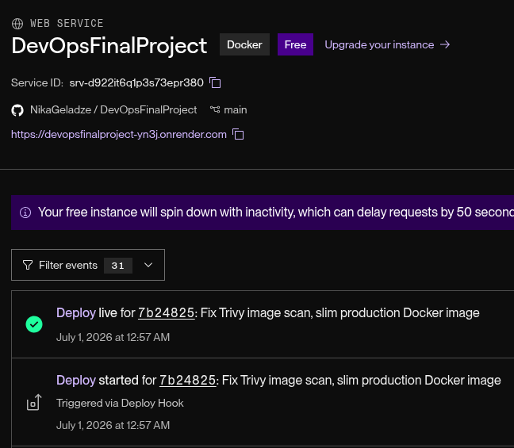

> **How to capture:** Render dashboard showing live service + GitHub Actions deploy job success.
> **Placeholder:** Add `screenshots/render-deploy.png` after configuring Render.

### 11. Blocked Deployment (Failing Tests)

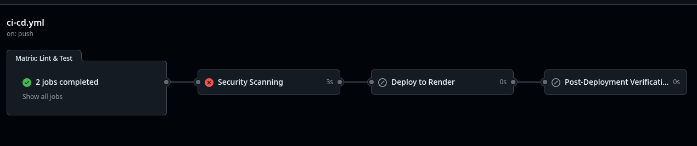

> **How to capture:** Push broken test intentionally → screenshot CI failing and deploy job skipped.
> **Placeholder:** Add `screenshots/blocked-deploy.png`.

---

## Analysis (Observability Lab)

### Why is JSON-structured logging more efficient than plain text?

JSON logs are machine-parseable: fields like `level`, `service`, and `timestamp` become indexed labels in Loki, enabling precise filtering (`{level="ERROR"}`) without regex. Plain text requires expensive pattern matching and produces inconsistent query results.

### Prometheus vs Loki — fundamental difference

**Prometheus** stores numeric time-series metrics (counters, histograms) optimized for aggregation and alerting (`rate()`, `histogram_quantile()`). **Loki** stores log streams indexed by labels, optimized for text search and correlation. Metrics answer "how much/how fast"; logs answer "what happened and why."

### Long-term log retention (6 months) without disk depletion

Use **retention policies** (Loki compactor + S3/GCS object storage), **sampling** for debug-level logs, **aggregation** (metrics from logs for trends), and **tiered storage** (hot SSD for 7 days, cold object storage for archives). Prometheus handles long-term metrics via remote write to Thanos/Mimir.

---

## Testing Guide

### 1. Unit Tests & Lint

```bash
cd app && npm test && npm run lint
```

### 2. Full Stack

```bash
./setup.sh
./scripts/validate-env.sh
curl http://localhost:5000/health
curl http://localhost:5000/metrics | head
```

### 3. Alert Simulation

```bash
./scripts/trigger-alert.sh
open http://localhost:9090/alerts
```

### 4. Blue-Green + Rollback

```bash
./scripts/deploy.sh blue
./scripts/deploy.sh green
curl http://localhost:3001/health
./scripts/rollback.sh
```

### 5. Health Monitor

```bash
./scripts/health_check.sh &
sleep 65 && tail logs/health.log
```

### 6. CI Pipeline

Push to `dev` branch → verify lint + test + security jobs pass on GitHub Actions.

### 7. Cloud Deploy

1. Create Render web service from `render.yaml`
2. Add GitHub secrets: `RENDER_DEPLOY_HOOK_URL`, `PRODUCTION_URL`
3. Push to `main` → verify deploy + post-deploy-verify jobs

---

## Live Application

> **Cloud URL:** `https://devopsfinalproject-yn3j.onrender.com`

---

## Submission Checklist

- [ ] GitHub repository link (public)
- [ ] Updated README.md (this file)
- [ ] All screenshots captured and placed in `screenshots/`
- [ ] `./setup.sh` runs successfully on a clean machine
- [ ] CI pipeline passes on `main`
- [ ] Render deployment configured (optional but recommended for Assignment 1 CD)
- [ ] Alert simulation demonstrated (`./scripts/trigger-alert.sh`)

---

## License

ISC
